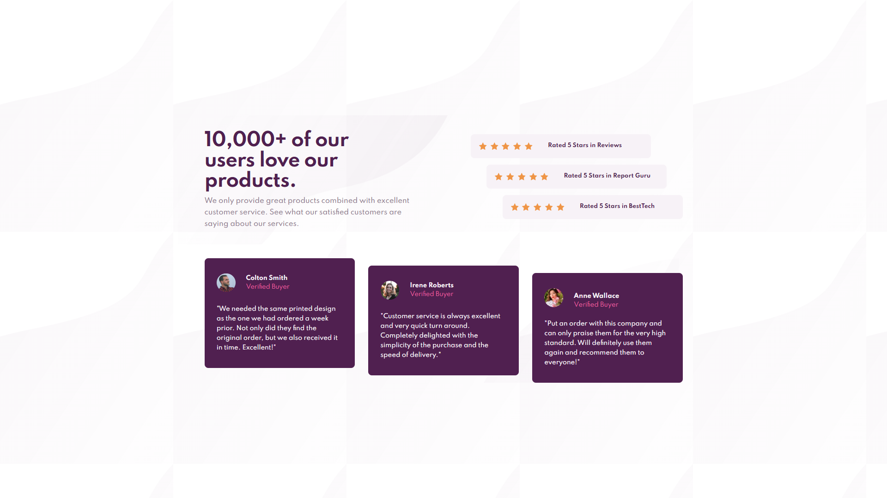

# Frontend Mentor - Social proof section solution

This is a solution to the [Social proof section challenge on Frontend Mentor](https://www.frontendmentor.io/challenges/social-proof-section-6e0qTv_bA). 

## Table of contents

- [Overview](#overview)
  - [The challenge](#the-challenge)
  - [Screenshot](#screenshot)
  - [Links](#links)
- [My process](#my-process)
  - [Built with](#built-with)
  - [What I learned](#what-i-learned)
  - [Continued development](#continued-development)

## Overview

### The challenge

Your task is to build out the project to the designs inside the `/design` folder. You will find both a mobile and a desktop version of the design. 

The designs are in JPG static format. Using JPGs will mean that you'll need to use your best judgment for styles such as `font-size`, `padding` and `margin`. 

Users should be able to:

- View the optimal layout for the section depending on their device's screen size

### Screenshot

I've included 4 screenshots in the `/screenshots` folder: mobile, tablet, desktop, and fullscreen.

### Links

I'll update these links once I've submitted my solution. 

- [Solution URL](https://your-solution-url.com)
- [Live Site URL](https://your-live-site-url.com)

## My process

I started with the HTML while observing the desktop version then wrote the CSS for the mobile version and 
slowly expanded from there. 

### Built with

- Semantic HTML5 markup
- CSS custom properties
- Flexbox
- Mobile-first workflow

### What I learned

I knew about the social proof section of a website, but I hadn't made one yet, so this gave me some practice
on that front. 

### Continued development

Completed this in the 4-6 hour window I set for myself, so I'm happy with that. Had a bit of disruption in there somewhere, but nothing too serious. 

This is the last of the "newbie" challenges, so I'll be moving to the "junior" ones from now on, God-willing. 
Hoping to get some JavaScript practice in there somewhere as well.

Here's to greater things! 